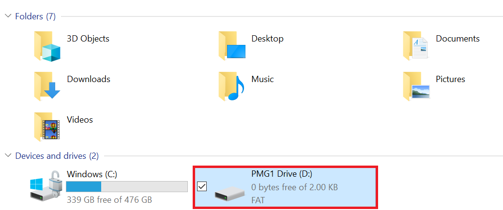
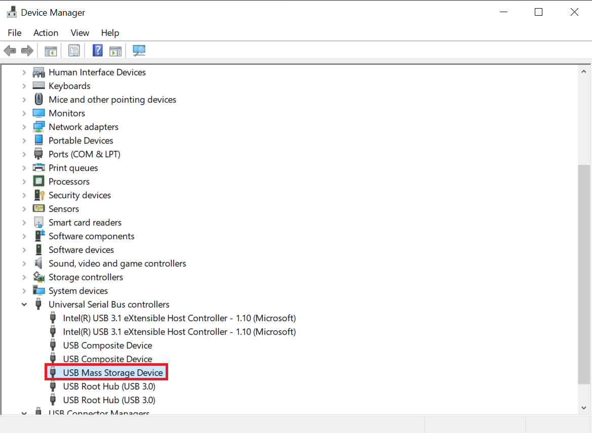
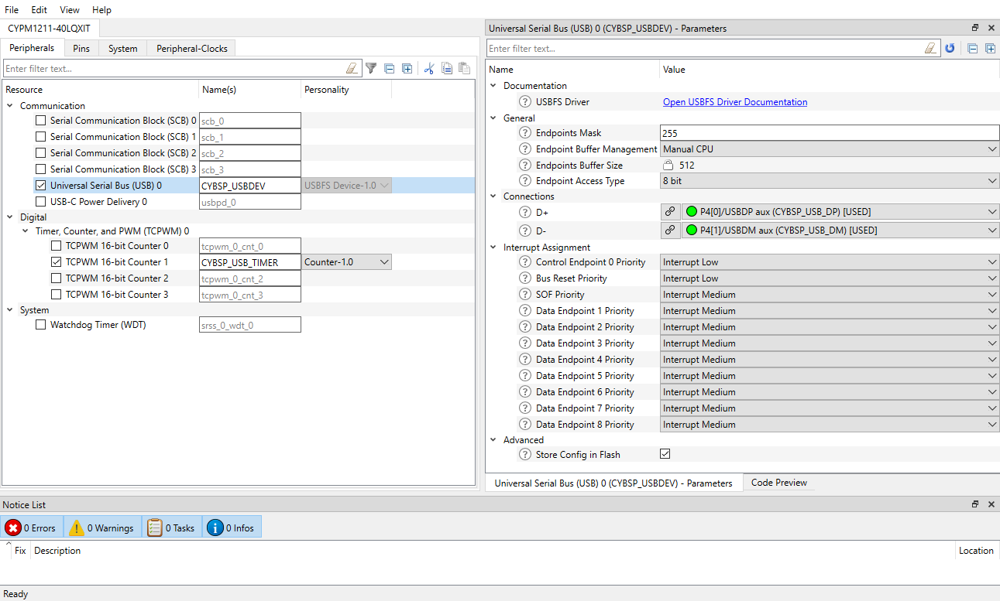
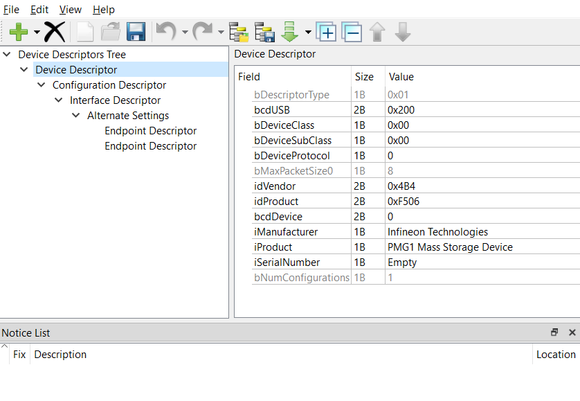
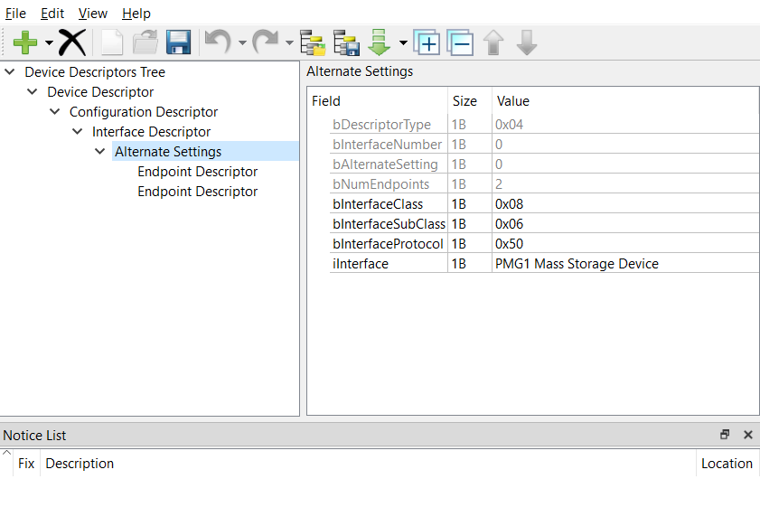
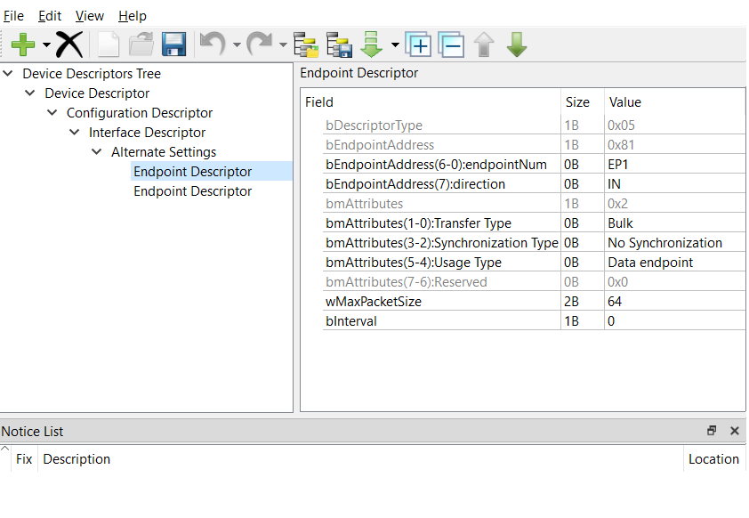
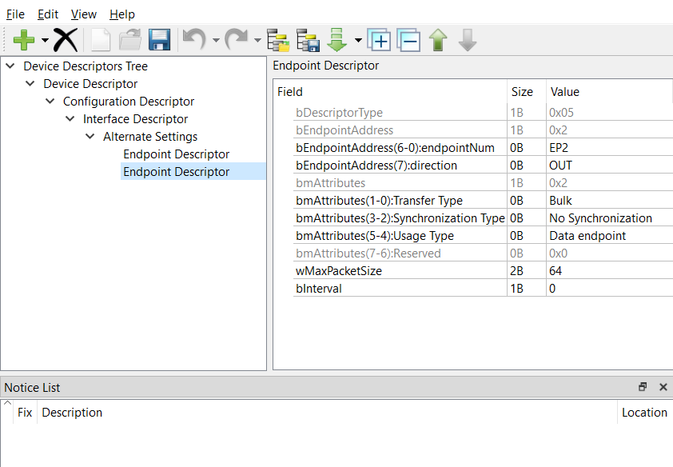
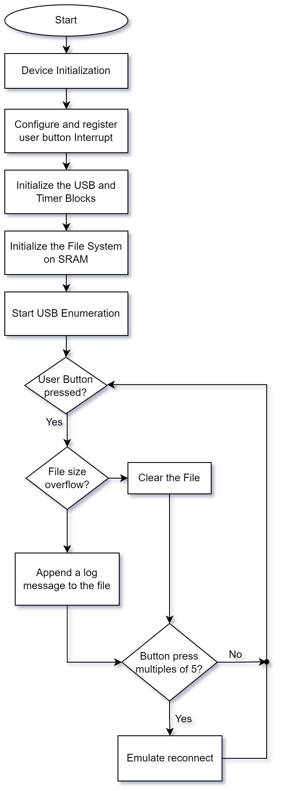

# EZ-PD™ PMG1 MCU: USB MSC file system in SRAM

This code example demonstrates how to configure the USB block on EZ-PD™ PMG1 MCU as a Mass Storage Class (MSC) device and will emulate a file system in the SRAM memory. The firmware emulates a file system using the internal memory with one file, which is visible to the USB host. The content of the file changes every time the user presses the kit button.

[View this README on GitHub.](https://github.com/Infineon/mtb-example-pmg1-usbfs-msc-fs-sram)

[Provide feedback on this code example.](https://cypress.co1.qualtrics.com/jfe/form/SV_1NTns53sK2yiljn?Q_EED=eyJVbmlxdWUgRG9jIElkIjoiQ0UyMzUwMTciLCJTcGVjIE51bWJlciI6IjAwMi0zNTAxNyIsIkRvYyBUaXRsZSI6IkVaLVBE4oSiIFBNRzEgTUNVOiBVU0IgTVNDIGZpbGUgc3lzdGVtIGluIFNSQU0iLCJyaWQiOiJhcCIsIkRvYyB2ZXJzaW9uIjoiMi4wLjAiLCJEb2MgTGFuZ3VhZ2UiOiJFbmdsaXNoIiwiRG9jIERpdmlzaW9uIjoiTUNEIiwiRG9jIEJVIjoiV0lSRUQiLCJEb2MgRmFtaWx5IjoiVFlQRS1DIn0=)

## Requirements

- [ModusToolbox&trade; software](https://www.infineon.com/modustoolbox) v3.0 or later (tested with v3.0)
- Board support package (BSP) minimum required version: 3.0.0
- Programming language: C
- Associated parts: [EZ-PD&trade; PMG1-S2 MCU](https://www.infineon.com/CY7112) and [EZ-PD&trade; PMG1-S3 MCU](https://www.infineon.com/CY7113)

## Supported toolchains (make variable 'TOOLCHAIN')

- GNU Arm&reg; Embedded Compiler v10.3.1 (`GCC_ARM`) – Default value of `TOOLCHAIN`
- Arm&reg; Compiler v6.13 (`ARM`)
- IAR C/C++ Compiler v8.42.2 (`IAR`)

## Supported kits (make variable 'TARGET')

- [EZ-PD&trade; PMG1-S2 prototyping kit](https://www.infineon.com/CY7112) (`PMG1-CY7112`) – Default value of `TARGET`
- [EZ-PD&trade; PMG1-S3 prototyping kit](https://www.infineon.com/CY7113) (`PMG1-CY7113`)


## Hardware setup

1. Connect the board to your PC using the provided USB cable through the KitProg3 USB connector. This cable is used for programming the PMG1 MCU device.

2. Connect the USB Type-C port using the J10 connector to your PC using the USB Type-C cable. See the [EZ-PD&trade; PMG1 MCU prototyping kits guide](https://www.infineon.com/dgdl/Infineon-CY7110_CY7111_CY7112_EZ-PD_PMG1_Prototyping_Kit_Guide-UserManual-v01_03-EN.pdf?fileId=8ac78c8c7d0d8da4017d0fb2ee922768) to ensure that the board is configured correctly.

3. If UART debug print messages are enabled, UART connections are required. Pin connections for UART is as shown in the following table. For the following revisions of the PMG1 prototyping kits, connect the UART Tx and UART Rx lines from the PMG1 kit to J3.8 and J3.10 on KitProg3 respectively to establish a UART connection between KitProg3 and the PMG1 device.

**Table 1. Pin connections for UART**

|PMG1 kit              | UART Tx       | UART Rx       |
| :------------------------------  | :-------------| :-------------|
|PMG1-CY7112 (revision 2 or lower) | J6.10 to J3.8 | J6.9 to J3.10 |
|PMG1-CY7113 (revision 3 or lower) | J6.10 to J3.8 | J6.9 to J3.10 |

**Note:** All prototyping kits with a higher revision have UART pins internally connected. Therefore, external wiring is not required.
See the kit user guide to ensure that the board is configured correctly.

## Software setup

Install a terminal emulator if you don't have one. Instructions in this document use [Tera Term](https://ttssh2.osdn.jp/index.html.en).

A terminal emulator is required to view UART debug print messages when DEBUG_PRINT is enabled.


## Using the code example

Create the project and open it using one of the following:

<details><summary><b>In Eclipse IDE for ModusToolbox&trade; software</b></summary>

1. Click the **New Application** link in the **Quick Panel** (or, use **File** > **New** > **ModusToolbox&trade; Application**). This launches the [Project Creator](https://www.infineon.com/ModusToolboxProjectCreator) tool.

2. Pick a kit supported by the code example from the list shown in the **Project Creator - Choose Board Support Package (BSP)** dialog.

   When you select a supported kit, the example is reconfigured automatically to work with the kit. To work with a different supported kit later, use the [Library Manager](https://www.infineon.com/ModusToolboxLibraryManager) to choose the BSP for the supported kit. You can use the Library Manager to select or update the BSP and firmware libraries used in this application. To access the Library Manager, click the link from the **Quick Panel**.

   You can also just start the application creation process again and select a different kit.

   If you want to use the application for a kit not listed here, you may need to update the source files. If the kit does not have the required resources, the application may not work.

3. In the **Project Creator - Select Application** dialog, choose the example by enabling the checkbox.

4. (Optional) Change the suggested **New Application Name**.

5. The **Application(s) Root Path** defaults to the Eclipse workspace which is usually the desired location for the application. If you want to store the application in a different location, you can change the *Application(s) Root Path* value. Applications that share libraries should be in the same root path.

6. Click **Create** to complete the application creation process.

For more details, see the [Eclipse IDE for ModusToolbox&trade; software user guide](https://www.infineon.com/MTBEclipseIDEUserGuide) (locally available at *{ModusToolbox&trade; software install directory}/docs_{version}/mt_ide_user_guide.pdf*).

</details>

<details><summary><b>In command-line interface (CLI)</b></summary>

ModusToolbox&trade; software provides the Project Creator as both a GUI tool and the command line tool, "project-creator-cli". The CLI tool can be used to create applications from a CLI terminal or from within batch files or shell scripts. This tool is available in the *{ModusToolbox&trade; software install directory}/tools_{version}/project-creator/* directory.

Use a CLI terminal to invoke the "project-creator-cli" tool. On Windows, use the command line "modus-shell" program provided in the ModusToolbox&trade; software installation instead of a standard Windows command-line application. This shell provides access to all ModusToolbox&trade; software tools. You can access it by typing `modus-shell` in the search box in the Windows menu. In Linux and macOS, you can use any terminal application.

The "project-creator-cli" tool has the following arguments:

Argument | Description | Required/optional
---------|-------------|-----------
`--board-id` | Defined in the `<id>` field of the [BSP](https://github.com/Infineon?q=bsp-manifest&type=&language=&sort=) manifest | Required
`--app-id`   | Defined in the `<id>` field of the [CE](https://github.com/Infineon?q=ce-manifest&type=&language=&sort=) manifest | Required
`--target-dir`| Specify the directory in which the application is to be created if you prefer not to use the default current working directory | Optional
`--user-app-name`| Specify the name of the application if you prefer to have a name other than the example's default name | Optional

<br>

The following example clones the "[Usbfs Msc FsSram](https://github.com/Infineon/mtb-example-pmg1-usbfs-msc-fs-sram)" application with the desired name "MyUsbfsMscFsSram" configured for the *PMG1-CY7112* BSP into the specified working directory, *C:/mtb_projects*:

   ```
   project-creator-cli --board-id PMG1-CY7112 --app-id mtb-example-pmg1-usbfs-msc-fs-sram --user-app-name MyUsbfsMscFsSram --target-dir "C:/mtb_projects"
   ```

**Note:** The project-creator-cli tool uses the `git clone` and `make getlibs` commands to fetch the repository and import the required libraries. For details, see the "Project creator tools" section of the [ModusToolbox&trade; software user guide](https://www.infineon.com/ModusToolboxUserGuide) (locally available at *{ModusToolbox&trade; software install directory}/docs_{version}/mtb_user_guide.pdf*).

To work with a different supported kit later, use the [Library Manager](https://www.infineon.com/ModusToolboxLibraryManager) to choose the BSP for the supported kit. You can invoke the Library Manager GUI tool from the terminal using `make library-manager` command or use the Library Manager CLI tool "library-manager-cli" to change the BSP.

The "library-manager-cli" tool has the following arguments:

Argument | Description | Required/optional
---------|-------------|-----------
`--add-bsp-name` | Name of the BSP that should be added to the application | Required
`--set-active-bsp` | Name of the BSP that should be as active BSP for the application | Required
`--add-bsp-version`| Specify the version of the BSP that should be added to the application if you do not wish to use the latest from manifest | Optional
`--add-bsp-location`| Specify the location of the BSP (local/shared) if you prefer to add the BSP in a shared path | Optional

<br>

Following example adds the PMG1-CY7112 BSP to the already created application and makes it the active BSP for the app:

   ```
   ~/ModusToolbox/tools_3.0/library-manager/library-manager-cli --project "C:/mtb_projects/MyUsbfsMscFsSram" --add-bsp-name PMG1-CY7112 --add-bsp-version "latest-v3.X" --add-bsp-location "local"

   ~/ModusToolbox/tools_3.0/library-manager/library-manager-cli --project "C:/mtb_projects/MyUsbfsMscFsSram" --set-active-bsp APP_PMG1-CY7112
   ```

</details>

<details><summary><b>In third-party IDEs</b></summary>

Use one of the following options:

- **Use the standalone [Project Creator](https://www.infineon.com/ModusToolboxProjectCreator) tool:**

   1. Launch Project Creator from the Windows Start menu or from *{ModusToolbox&trade; software install directory}/tools_{version}/project-creator/project-creator.exe*.

   2. In the initial **Choose Board Support Package** screen, select the BSP, and click **Next**.

   3. In the **Select Application** screen, select the appropriate IDE from the **Target IDE** drop-down menu.

   4. Click **Create** and follow the instructions printed in the bottom pane to import or open the exported project in the respective IDE.

<br>

- **Use command-line interface (CLI):**

   1. Follow the instructions from the **In command-line interface (CLI)** section to create the application.

   2. Export the application to a supported IDE using the `make <ide>` command.

   3. Follow the instructions displayed in the terminal to create or import the application as an IDE project.

For a list of supported IDEs and more details, see the "Exporting to IDEs" section of the [ModusToolbox&trade; software user guide](https://www.infineon.com/ModusToolboxUserGuide) (locally available at *{ModusToolbox&trade; software install directory}/docs_{version}/mtb_user_guide.pdf*).

</details>


## Operation

1. Ensure that the steps listed in the [Hardware setup](#hardware-setup) section are completed.

2. Ensure that the jumper shunt on power selection jumper (J5) is placed at position 2-3 to enable programming.

3. Program the board using one of the following:

   <details><summary><b>Using Eclipse IDE for ModusToolbox&trade; software</b></summary>

      1. Select the application project in the Project Explorer.

      2. In the **Quick Panel**, scroll down, and click **\<Application Name> Program (KitProg3_MiniProg4)**.
   </details>

   <details><summary><b>Using CLI</b></summary>

     From the terminal, execute the `make program` command to build and program the application using the default toolchain to the default target. The default toolchain is specified in the application's Makefile but you can override this value manually:
      ```
      make program TOOLCHAIN=<toolchain>
      ```

      Example:
      ```
      make program TOOLCHAIN=GCC_ARM
      ```
   </details>

4. After programming the kit, change the position on the power selection jumper (J5) to 1–2 to power the kit through the USB PD port.

5. Connect another USB cable (or reuse the same cable used to program the kit) to the USB connector (J10).

6. On the PC, verify that the OS recognizes a new portable device named "PMG1 Drive". Open the *PMG1 Drive* device and confirm that a file *LOG.TXT* is readable.

   **Figure 1. PMG1 MSC drive**

   


7. Additionally, open the Device Manager on the PC and verify that the device is enumerated as a *USB Mass Storage Device*.

   **Figure 2. USB Mass Storage Device**

   

8. Open the *LOG.TXT* file and read the content. It must have the following message:
   ```
   PMG1 MSC Device Content:
   ```

9. Close the *LOG.TXT* file.

10. Press the button five times. It will emulate the device being ejected and inserted back, forcing the OS to re-read the changes in the mass storage.

11. Open the *LOG.TXT* file again and check whether new content was added to the file:
      ```
      PMG1 MSC Device Content:
      > Button press 1 time(s)
      > Button press 2 time(s)
      > Button press 3 time(s)
      > Button press 4 time(s)
      > Button press 5 time(s)
      ```

12. Alternatively, press the button for 'n' times. Disconnect and reconnect the USB cable connected to a USB PD port to enumerate the device again. Open the *LOG.TXT* file again and check whether 'n' lines were appended to the file (if it does not exceed the disk size).

## Debugging

You can debug the example to step through the code. In the IDE, use the **\<Application Name> Debug (KitProg3_MiniProg4)** configuration in the **Quick Panel**. For details, see the "Program and debug" section in the [Eclipse IDE for ModusToolbox&trade; software user guide](https://www.infineon.com/MTBEclipseIDEUserGuide).

Ensure that the board is connected to your PC using the USB cable through the KitProg3 USB connector and the jumper shunt on the power selection jumper (J5) is placed at positions 1-2. See the "Programming and debugging the CY7112 kit" section in the [EZ-PD&trade; PMG1 MCU prototyping kits guide](https://www.infineon.com/dgdl/Infineon-CY7110_CY7111_CY7112_EZ-PD_PMG1_Prototyping_Kit_Guide-UserManual-v01_03-EN.pdf?fileId=8ac78c8c7d0d8da4017d0fb2ee922768) for debugging the application on CY7112 prototyping kit.


## Design and implementation

In the main firmware routine, the USB device block is configured to use the MSC device class. The firmware also creates a simple FAT file system placed on the internal SRAM. It creates a single file named *LOG.TXT*. The file size is configurable through a macro and the necessary memory is allocated automatically. The USB host can only read the contents of the file. You can write to the file from the host computer but the change will not take effect in the PMG1 drive file system because it has only read-only support. No new directory or file is supported due to limited SRAM memory.

Internally, the firmware can write data strings to the file system or erase the entire file content. For example, the firmware writes a message every time the kit user button is pressed. To read the new file content, you must disconnect and reconnect the USB cable, so that the OS requests again for the content in the file system.

The firmware also emulates the device being ejected at every five user button presses. This forces the OS to re-read the contents of the file system.


### Device configuration

Do the following to view the MSC descriptor:

1. Select the application project in the Project Explorer.

2. In the Quick Panel, select **BSP configurator** and click **Device Configurator**.

3. In the **Peripherals** section, select **Universal Serial Bus (USB) 0** to view the USB configuration fields as shown in the following figure. Note that the USB Peripheral personality is set as **USBFS Device-1.0**.

   **Figure 3. Universal Serial Bus (USB) 0 configuration using Device Configurator**

   


### USB configuration

1. Select the application project in the Project Explorer.

2. In the Quick Panel, select **BSP configurator** and click **USB Configurator**.

   Some of the descriptor configurations are shown in the following figures.


   **Figure 4. USB MSC device descriptor**

   

   <br>

   **USB Mass Storage Class alternate settings**

   - bInterfaceClass:  Names the device class
   - 0x08: Indicates that the device is a mass storage device

   **Figure 5. USB MSC alternate settings**

   

   <br>

   **Endpoint descriptors**

     - The two endpoint descriptors act as buffers storing the received data or data waiting to be transmitted.

     - The **bEndpointAddress(7):direction** is an important field in endpoint descriptors. The endpoint is defined as IN and provides the data to send to the host while another endpoint is defined as OUT and stores data received from the host.

   **Figure 6. USB MSC IN data endpoint 1 descriptor**

   

   <br>

   **Figure 7. USB MSC OUT data endpoint 2 descriptor**

   

### Firmware flowchart

The following figure shows the processes of the USB block as an MSC emulation device file system in the SRAM memory.

**Figure 8. Firmware flowchart**



<br>

### Compile-time configurations

The PMG1 MCU USB MSC file system in SRAM application functionality can be customized through a set of compile-time parameter that can be turned ON/OFF through the *main.c* file.

 Macro name          | Description                           | Allowed values
 :------------------ | :------------------------------------ | :-------------
 `DEBUG_PRINT`     | Debug print macro to enable UART print  | 1u to enable <br> 0u to disable |

<br>

### Resources and settings

**Table 2. Application resources**

 Resource     |  Alias/object   |    Purpose
 :-------     | :------------   | :------------
 USBDEV (PDL) | CYBSP_USBDEV    | USB device configured with mass storage descriptor
 Timer  (PDL) | CYBSP_USB_TIMER | Timer configured to detect USB Suspend condition
 Switch (PDL) | CYBSP_USER_BTN  | User button to write a log to the file
 UART (BSP) | CYBSP_UART       | UART object used for Debug UART port

<br>

### Application files and their usage

| File                         | Purpose                               |
| :--------------------------- | :------------------------------------ |
| *config.h*              | Configures some global options for the application |
| *file_system.h/c*       | Implements the FAT file system |
| *usb_comm.h/c*          | Implements the USB MSC device class requests |
| *usb_scsi.h/c*          | Implements the USB SCSI protocol, which is used by the USB MSC device class |
| *cy_usb_dev_msc.h/c*    | Implements the USB device middleware for the USB MSC device class (these files will eventually move to *usbdev.lib*) |

<br>

## Related resources

Resources | Links
-----------|------------------
Application notes |[AN232553](https://www.infineon.com/AN232553) – Getting started with EZ-PD&trade; PMG1 MCU on ModusToolbox&trade; software <br> [AN232565](https://www.infineon.com/an232565) – EZ-PD&trade; PMG1 hardware design guidelines and checklist
Code examples  | [Using ModusToolbox&trade; software](https://github.com/Infineon/Code-Examples-for-ModusToolbox-Software) on GitHub
Device documentation | [EZ-PD&trade; PMG1 MCU datasheets](https://www.infineon.com/PMG1DS)
Development kits | Select your kits from the [Evaluation Board Finder](https://www.infineon.com/cms/en/design-support/finder-selection-tools/product-finder/evaluation-board) page.
Libraries on GitHub | [mtb-pdl-cat2](https://github.com/Infineon/mtb-pdl-cat2) – Peripheral driver library (PDL) and docs
Tools | [Eclipse IDE for ModusToolbox&trade; software](https://www.infineon.com/modustoolbox) <br> ModusToolbox&trade; software is a collection of easy-to-use software and tools enabling rapid development with Infineon MCUs, covering applications from embedded sense and control to wireless and cloud-connected systems using AIROC™ Wi-Fi & Bluetooth® combo devices.

## Other resources

Infineon provides a wealth of data at www.infineon.com to help you select the right device, and quickly and effectively integrate it into your design.

## Document history

Document title: *CE235017* – *EZ-PD&trade; PMG1 MCU: USB MSC file system in SRAM*

| Version | Description of change |
| ------- | --------------------- |
| 1.0.0   | New code example      |
| 2.0.0   | Major update to support ModusToolbox&trade; v3.0. This version is not backward compatible with previous versions of ModusToolbox&trade; |
------

All other trademarks or registered trademarks referenced herein are the property of their respective owners.

-------------------------------------------------------------------------------

© Cypress Semiconductor Corporation, 2022-2023. This document is the property of Cypress Semiconductor Corporation, an Infineon Technologies company, and its affiliates (“Cypress”). This document, including any software or firmware included or referenced in this document (“Software”), is owned by Cypress under the intellectual property laws and treaties of the United States and other countries worldwide. Cypress reserves all rights under such laws and treaties and does not, except as specifically stated in this paragraph, grant any license under its patents, copyrights, trademarks, or other intellectual property rights. If the Software is not accompanied by a license agreement and you do not otherwise have a written agreement with Cypress governing the use of the Software, then Cypress hereby grants you a personal, non-exclusive, nontransferable license (without the right to sublicense) (1) under its copyright rights in the Software (a) for Software provided in source code form, to modify and reproduce the Software solely for use with Cypress hardware products, only internally within your organization, and (b) to distribute the Software in binary code form externally to end users (either directly or indirectly through resellers and distributors), solely for use on Cypress hardware product units, and (2) under those claims of Cypress’s patents that are infringed by the Software (as provided by Cypress, unmodified) to make, use, distribute, and import the Software solely for use with Cypress hardware products. Any other use, reproduction, modification, translation, or compilation of the Software is prohibited.
<br>
TO THE EXTENT PERMITTED BY APPLICABLE LAW, CYPRESS MAKES NO WARRANTY OF ANY KIND, EXPRESS OR IMPLIED, WITH REGARD TO THIS DOCUMENT OR ANY SOFTWARE OR ACCOMPANYING HARDWARE, INCLUDING, BUT NOT LIMITED TO, THE IMPLIED WARRANTIES OF MERCHANTABILITY AND FITNESS FOR A PARTICULAR PURPOSE. No computing device can be absolutely secure. Therefore, despite security measures implemented in Cypress hardware or software products, Cypress shall have no liability arising out of any security breach, such as unauthorized access to or use of a Cypress product. CYPRESS DOES NOT REPRESENT, WARRANT, OR GUARANTEE THAT CYPRESS PRODUCTS, OR SYSTEMS CREATED USING CYPRESS PRODUCTS, WILL BE FREE FROM CORRUPTION, ATTACK, VIRUSES, INTERFERENCE, HACKING, DATA LOSS OR THEFT, OR OTHER SECURITY INTRUSION (collectively, “Security Breach”). Cypress disclaims any liability relating to any Security Breach, and you shall and hereby do release Cypress from any claim, damage, or other liability arising from any Security Breach. In addition, the products described in these materials may contain design defects or errors known as errata which may cause the product to deviate from published specifications. To the extent permitted by applicable law, Cypress reserves the right to make changes to this document without further notice. Cypress does not assume any liability arising out of the application or use of any product or circuit described in this document. Any information provided in this document, including any sample design information or programming code, is provided only for reference purposes. It is the responsibility of the user of this document to properly design, program, and test the functionality and safety of any application made of this information and any resulting product. “High-Risk Device” means any device or system whose failure could cause personal injury, death, or property damage.  Examples of High-Risk Devices are weapons, nuclear installations, surgical implants, and other medical devices. “Critical Component” means any component of a High-Risk Device whose failure to perform can be reasonably expected to cause, directly or indirectly, the failure of the High-Risk Device, or to affect its safety or effectiveness. Cypress is not liable, in whole or in part, and you shall and hereby do release Cypress from any claim, damage, or other liability arising from any use of a Cypress product as a Critical Component in a High-Risk Device. You shall indemnify and hold Cypress, including its affiliates, and its directors, officers, employees, agents, distributors, and assigns harmless from and against all claims, costs, damages, and expenses, arising out of any claim, including claims for product liability, personal injury or death, or property damage arising from any use of a Cypress product as a Critical Component in a High-Risk Device. Cypress products are not intended or authorized for use as a Critical Component in any High-Risk Device except to the limited extent that (i) Cypress’s published data sheet for the product explicitly states Cypress has qualified the product for use in a specific High-Risk Device, or (ii) Cypress has given you advance written authorization to use the product as a Critical Component in the specific High-Risk Device and you have signed a separate indemnification agreement.
<br>
Cypress, the Cypress logo, and combinations thereof, WICED, ModusToolbox, PSoC, CapSense, EZ-USB, F-RAM, and Traveo are trademarks or registered trademarks of Cypress or a subsidiary of Cypress in the United States or in other countries. For a more complete list of Cypress trademarks, visit cypress.com. Other names and brands may be claimed as property of their respective owners.
